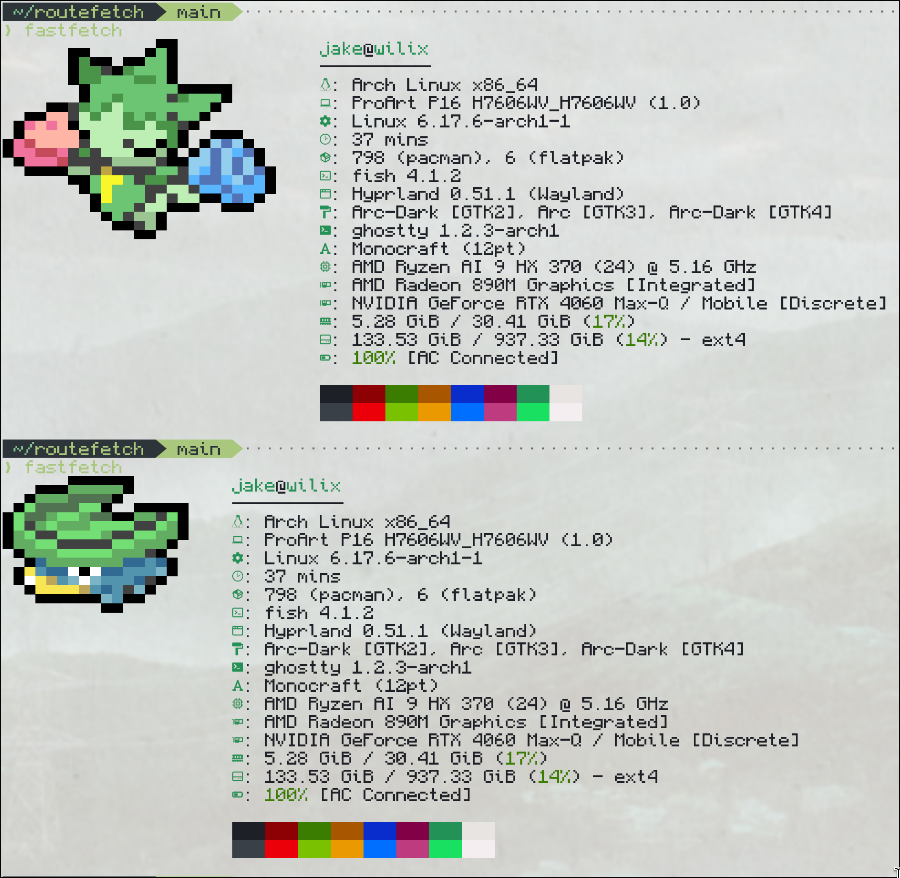

# Routefetch

### A Pokeget Script Designed with Fastfetch in Mind

Routefetch brings life to your terminal rice by displaying random Pokémon with varying rarity levels. It seamlessly integrates with Fastfetch to show different tiers of Pokémon in your system information display, with each Pokémon having a chance to appear as its shiny variant. This adds an element of surprise and discovery to your daily terminal usage.

## Pre-Requisites
- Pokeget (or pokeget-rs)

Routefetch uses Pokeget to render Pokémon images in the terminal. More information regarding Pokeget can be found at the [repo](https://github.com/talwat/pokeget-rs)

## Installation
If you want to use this for fastfetch, navigate to your fastfetch config.

```bash
cd ~/.config/fastfetch
```

Clone this repo into your fastfetch config folder.

```bash
git clone git@github.com:TitaniteScale/routefetch.git scripts
```

Then, in your fastfetch config file (fastfetch/config.jsonc), modify the type and source of the logo section such that it takes the execution of the shell script as a command:

```json
  "logo": {
    "type": "command-raw",
    "source": "~/.config/fastfetch/routefetch/routefetch.sh",
```

## Example


## How It Works

Routefetch randomly selects Pokémon from four different rarity tiers:
- Common (60% chance) - Pokémon like Bulbasaur, Caterpie, and Oddish
- Uncommon (30% chance) - Pokémon like Roselia, Grovyle, and Leafeon
- Rare (9% chance) - Pokémon like Snorlax, Venusaur, and Torterra
- Ultra Rare (1% chance) - Legendary Pokémon like Celebi and Jirachi

Additionally, every Pokémon has a 1% chance of appearing in its shiny form.
Changing the rates is very easy as the shell script is very simple.


Enjoy!
