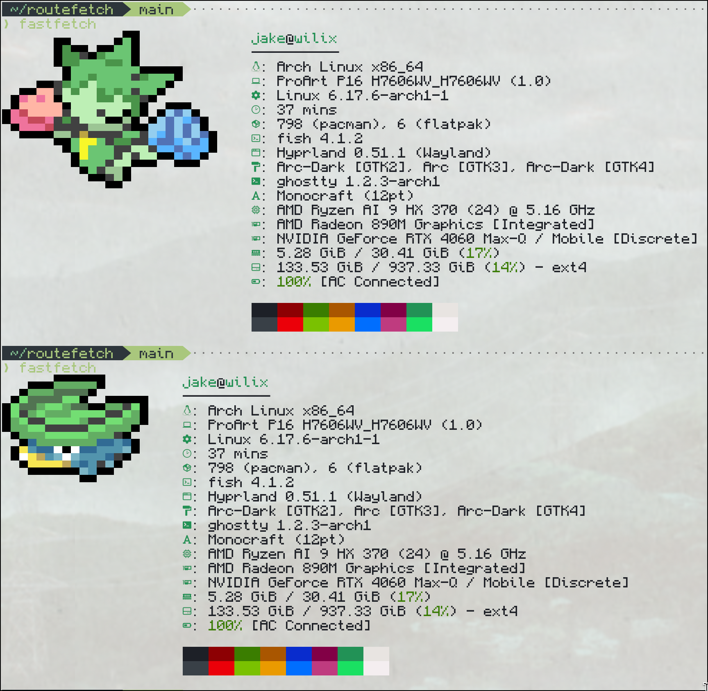

# Routefetch

### A Pokeget Script Designed with Fastfetch in Mind

Routefetch brings life to your terminal rice by displaying random Pokémon with varying rarity levels. It seamlessly integrates with Fastfetch to show different tiers of Pokémon in your system information display, with each Pokémon having a chance to appear as its shiny variant. This adds an element of surprise and discovery to your daily terminal usage.

## Pre-Requisites
- Pokeget (or pokeget-rs)

Routefetch uses Pokeget to render Pokémon images in the terminal. More information regarding Pokeget can be found at the [repo](https://github.com/talwat/pokeget-rs)

## Installation
If you want to use this for fastfetch, navigate to your fastfetch config.

```bash
cd ~/.config/fastfetch
```

Once in your fastfetch folder, clone this repo into a scripts folder.

```bash
git clone git@github.com:TitaniteScale/routefetch.git scripts
```

Then, in your fastfetch config, change the type and source of the logo to the following:

```json
  "logo": {
    "type": "command-raw",
    "source": "~/.config/fastfetch/scripts/routefetch.sh",
```

`routefetch.sh` expects its `lib/`, `config/`, and `data/` folders to stay
alongside it (that's how a plain `git clone` lays them out), so nothing else
needs to change.

## Example


## How It Works

Routefetch randomly selects a Pokémon from `data/rarity.tsv`, which groups
entries into four rarity tiers - common, uncommon, rare, and ultra rare - and
that file is the source of truth for exactly which Pokémon are in each tier.
By default the odds of landing in each tier are 60% / 30% / 9% / 1%.

Additionally, every Pokémon has a 1% chance of appearing in its shiny form
(configurable via `SHINY_ODDS`).

## Configuration

Settings live in `config/routefetch.conf.default`, the shipped defaults. To
customize them, copy it to `config/routefetch.conf` (untracked, always wins
over the default) and edit that:

```bash
cp config/routefetch.conf.default config/routefetch.conf
```

You can also point at a config file anywhere else with
`ROUTEFETCH_CONFIG=/path/to/file`.

| Key | Meaning |
| --- | --- |
| `DMG_MODE` | `off` / `green` / `gray` — see DMG Mode below |
| `DMG_COLORS` | reserved, not implemented yet — see Roadmap |
| `TIER_WEIGHT_COMMON` | relative weight of the common tier |
| `TIER_WEIGHT_UNCOMMON` | relative weight of the uncommon tier |
| `TIER_WEIGHT_RARE` | relative weight of the rare tier |
| `TIER_WEIGHT_ULTRA_RARE` | relative weight of the ultra rare tier |
| `SHINY_ODDS` | shiny chance, as 1-in-N (e.g. `100` = 1%) |

Tier weights don't need to sum to 100 — they're normalized automatically, so
doubling every value changes nothing, but raising just one raises that tier's
odds relative to the others.

Precedence, highest to lowest:
1. `ROUTEFETCH_DMG` env var (legacy override, `DMG_MODE` only)
2. `ROUTEFETCH_CONFIG=/path` env var
3. `config/routefetch.conf` (your copy)
4. `config/routefetch.conf.default` (shipped defaults)

## Rarity Table

`data/rarity.tsv` holds one line per Pokémon:

```
tier:weight:pokeget-args
```

- `tier` is one of `common`, `uncommon`, `rare`, `ultra_rare`.
- `weight` is a positive integer, relative *within that tier only* — it's
  independent from the `TIER_WEIGHT_*` config keys, which control the odds
  *between* tiers. All shipped entries use `1`, i.e. every Pokémon in a tier
  is equally likely; raise one entry's weight to favour it over its
  tier-mates.
- `pokeget-args` is passed straight through to `pokeget`, so an entry can
  carry extra flags, e.g. `rare:1:rotom --form wash`. Because this expands
  unquoted, a name or flag value here can't contain a literal space within
  one argument.

Blank lines and lines starting with `#` are ignored, so you can group and
comment the file however you like. Add or remove Pokémon by editing this
file directly — no need to touch any script.

## DMG Mode

Sprites can be re-rendered with a four-shade Game Boy palette. Set `DMG_MODE`
in `config/routefetch.conf` (see Configuration above):

```bash
DMG_MODE="green"
```

| Value | Result |
| --- | --- |
| `off` | Full colour sprites (default) |
| `green` | Original Game Boy (DMG) LCD green |
| `gray` | Four-level grayscale |

You can also flip it per-run without editing anything:

```bash
ROUTEFETCH_DMG=green ./routefetch.sh
```

The palette logic lives in `lib/dmg.sh`, which is a plain stdin/stdout
filter, so it works with any truecolor sprite and can be used on its own:

```bash
pokeget pikachu --hide-name | lib/dmg.sh
pokeget pikachu --hide-name | lib/dmg.sh --palette gray
pokeget pikachu --hide-name | lib/dmg.sh --colors '#0F380F,#306230,#8BAC0F,#9BBC0F'
```

Each colour in the sprite is ranked by luminance and reduced to four levels of
grey, and those levels then choose the shade to draw with. The luminance range
is stretched per sprite, so dark Pokémon still use the whole palette instead of
flattening into one shade. Transparent pixels stay transparent.

## Roadmap

- **More palettes** — Game Boy Pocket and Game Boy Light shades, on top of the
  existing `--colors` escape hatch.
- **Cries** — playing each Pokémon's cry when its sprite is shown, via an
  auto-detected player (`paplay`/`mpv`/`ffplay`/`mpg123`, whichever is
  found). Prototyped and then shelved: the real blocker isn't audio
  playback itself, it's that `routefetch.sh` has no way to tell "a genuinely
  new terminal session" apart from any other reason fastfetch might get
  re-invoked (e.g. a window resize/reflow), so cries risk firing far more
  often than intended. Needs that invocation-detection question solved
  first, probably with better tooling than a plain bash script check, before
  this is worth turning back on.
- **Bounce animation** — making the sprite bounce in place the way it would
  in-game, via an ANSI cursor-movement loop. Not implemented yet.


Enjoy!
